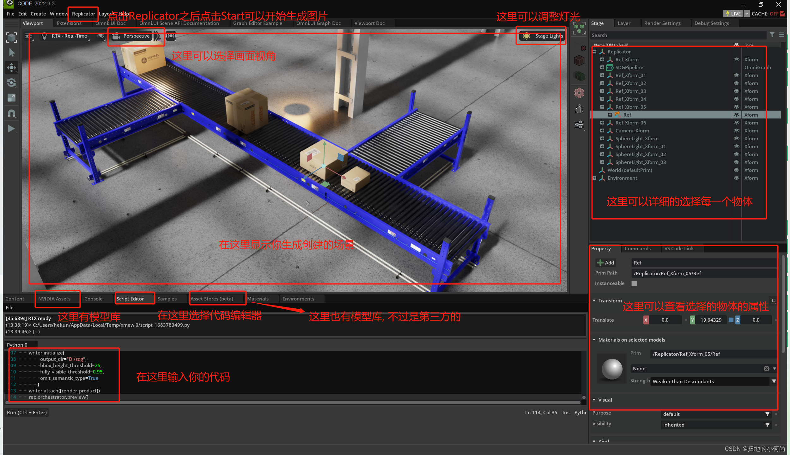
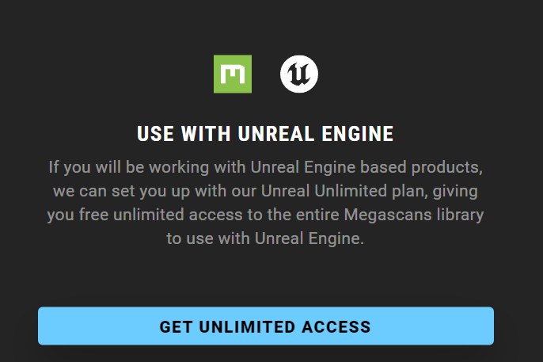
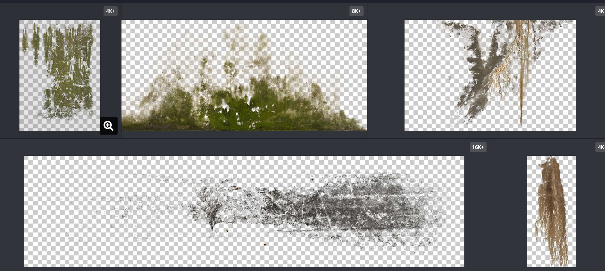

+ 官方教程
https://docs.omniverse.nvidia.com/extensions/latest/ext_replicator/getting_started.html
+ 安装教程CSDN
https://blog.csdn.net/kunhe0512/article/details/130620995
+ CODE界面

+ 油污贴图
https://quixel.com/megascans/home?category=surface&category=metal
+ 内容
  + 3D模型
  + 材质
  + 贴图：png+jpg+json
+ 优缺点
  + 兼容UE5，通过bridge浏览器，实现直接拖动直接导入ue进行开发
  + 资源背景不透明，不能直接在ov中使用
  
https://www.textures.com/browse/pbr-materials/114558#metal-ferrous
+ 内容
  + 3D模型
  + 材质
  + 贴图：图片格式，背景透明
+ 优缺点
  + 资源可以选择透明背景，方便OV开发
  + 收费！！！39美元/月
  
+ 材质贴图软件
  + http://www.boundingboxsoftware.com/materialize/ 一键生成DNR
  + https://www.bilibili.com/video/BV1Fx411o7xg/?spm_id_from=333.337.search-card.all.click&vd_source=70fe2f8a208e59f586dd05a3590fea23使用教程
+ 透明PNG
  + https://pngimg.com/images/nature/acorn
  + https://www.mksucai.com/sc/all-%E6%B2%B9%E6%B1%A1-all_all_0-hot-3.html 有油污，免费，比较卡通
  + https://www.textures.com/browse/pbr-materials/114558#metal-ferrous 素材比较全面，但是收费
  + https://www.rawpixel.com/search/stain?page=1&path=_topics&sort=curated 收费
  + https://www.vecteezy.com/free-png/dirt-texture 透明PNG，有污垢，有限制