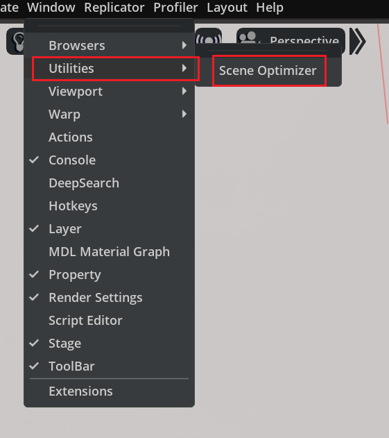
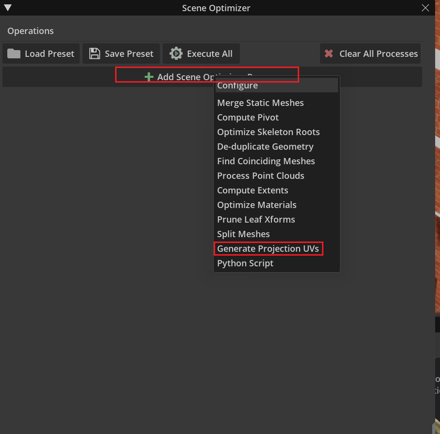
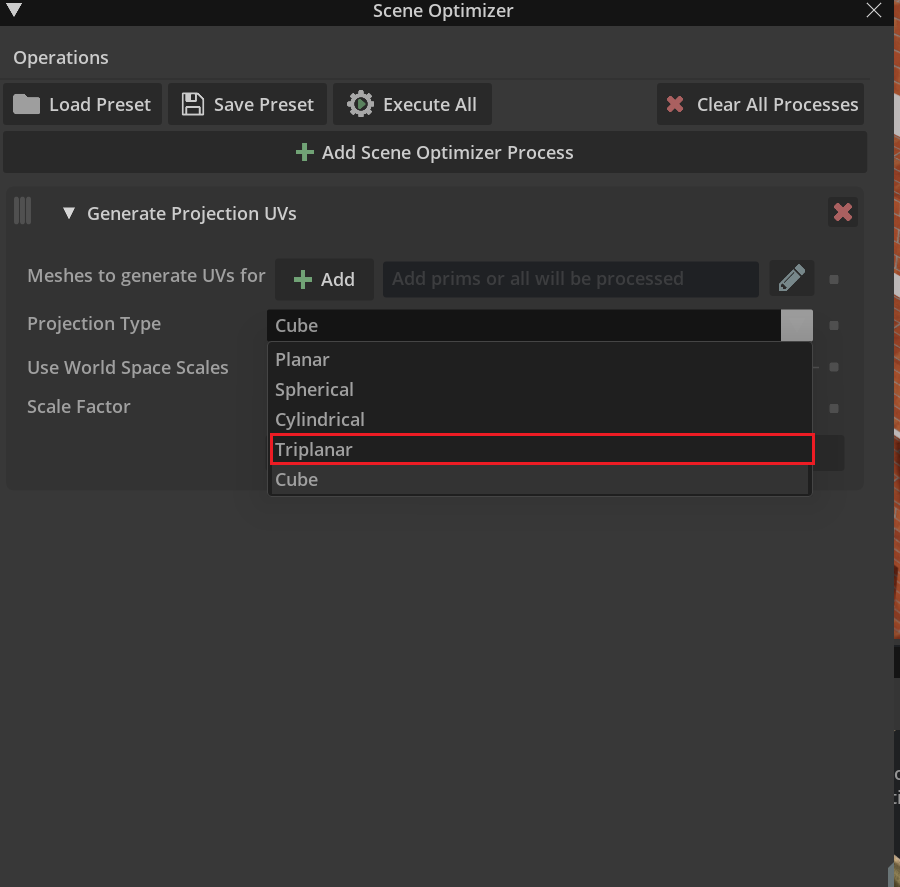
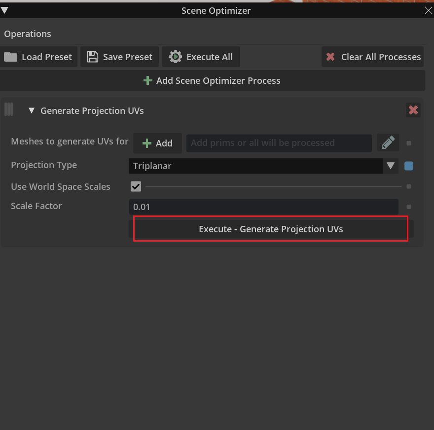

### 一些坑
+ shape VS mesh:shape是几何形状的抽象描述,mesh是shape的子类，有更多的细节渲染和特征。shape不能添加纹理，但mesh可以。
+ STL：只包含了形状的描述，不包含颜色和纹理，因此贴图需要加UVmap
### ov对不同格式文件的支持
+ STL：可以导入生成对应的USD,但无法添加纹理
### USD Explorer
+ SLDPRT:import模式+improt to stage可以正常渲染并互传，没有法向量
+ STEP：import模式+improt to stage可以正常渲染并互传，法向量格式不支持
+ STL：没有纹理(s缺少UVmap)，有法向量，UVmap可以通过Maya或者Blender进行编辑，3Dbuilder支持不好
https://youtu.be/U-_I8jnxwwM
+ 3dXML：法向量格式不支持
+ CGR：没有法向量
+ UE5：OBJ、FBX、MAX、MA、3DS、SLDPRT、STEP
### 方案
+ model->STL->纹理文件->贴缺陷
+ STL+UVmap:
  + blender:模型会变圆润(注意模型全选)
  + maya:体量太大
  + 直接导入OV(发现了一个超级哇塞的插件)
    + extension中安装Optimizer
  
  
  
  
+ 缺陷：
  + 缺陷的路径指定？
  + 缺陷需要三张图片叠加？
  + 缺陷的命名应该是_D_R_N?