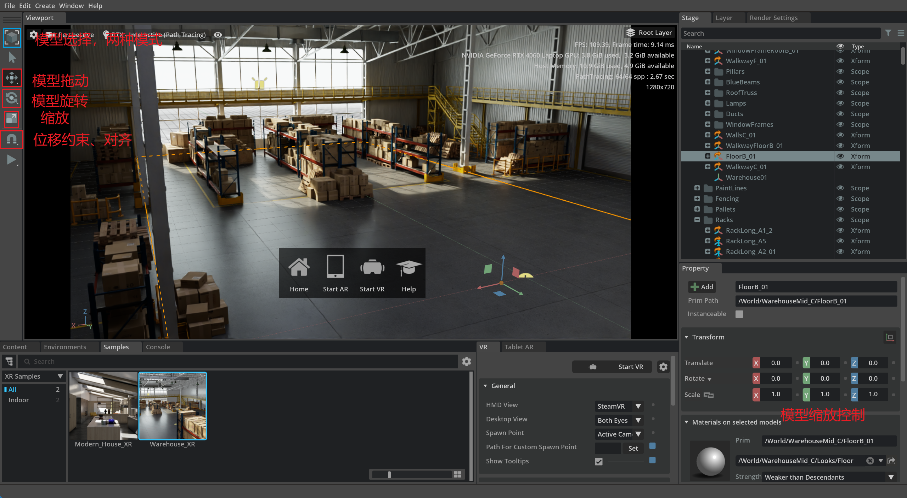
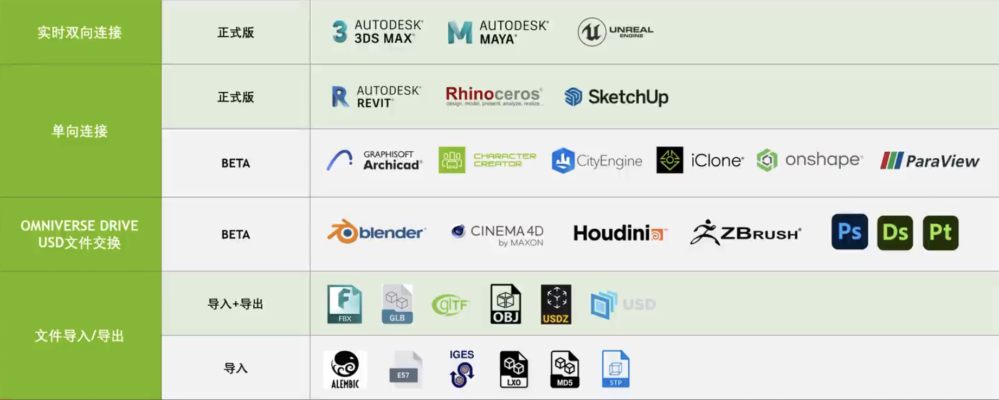
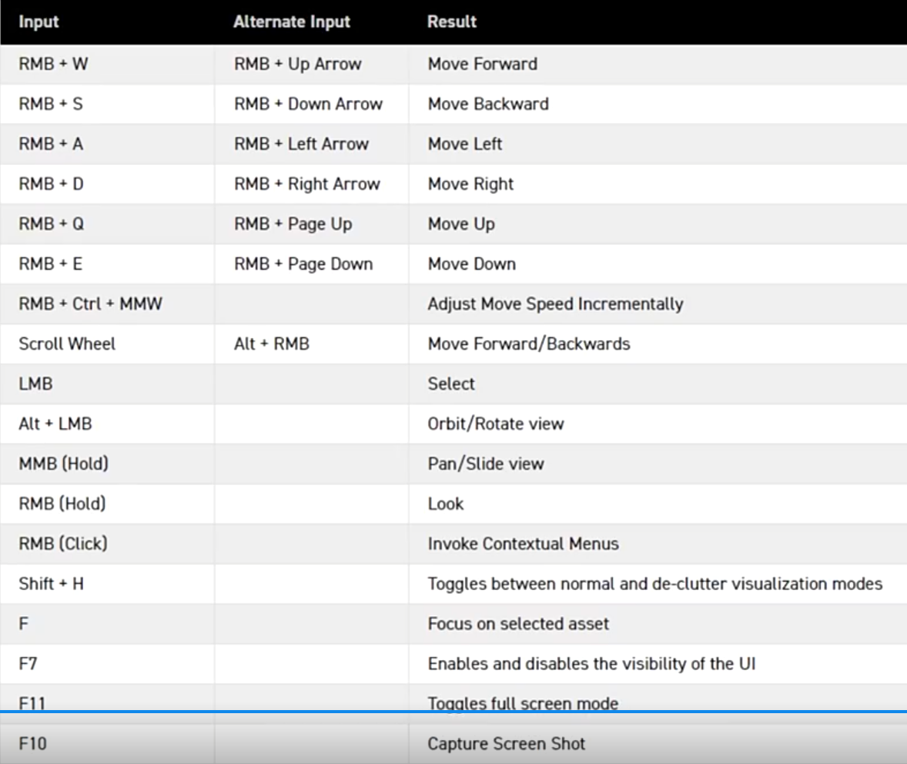

## omniverse简介
### 核心模块
+ NUCLEUS:同步服务基于USD，跨软件，USD同步和合作
+ CONNECT:3D设计软件连接器，连接跨软件工作流
+ KIT：底层核心
+ SIMULATION:物理仿真模拟
+ RTX RENDER:渲染器
### 常用应用
+ CREATE:场景构建和渲染器，USD查看、合成和修改
+ AUDIO2FACE:面部动画生成
+ MACHINIMA:AI动画生成
+ CODE:集成开发环境(IDE)
## omniverse安装和使用
+ GFORCE EXPERIENCE:Nvidia驱动版本更新和管理
  + 选择stuio版本驱动
+ Omniverse launcher:onmiverse平台，相当于installer，用于安装拓展
+ NUCLEUS:类似于NAS的基于网络的文件管理服务器
+ NVIGATOR:浏览器
+ CREATE:USD完整流程，创建与修改
## CREATE使用
### 界面
+ file:文件操作
+ edit:场景编辑，复制，编辑重组
+ create:场景合成，加入camera,light等
+ windows:本地工具页面管理，加进度条等
+ layout:页面布局
### 视图
#### 上方
+ setting:视图尺寸，相机设置
+ viewpoint:camera切换，相机添加
+ RTX RealTime:实时渲染器
  + interactivate:很快的光追渲染器
  + accurate:极真实的渲染模式，开销大
+ eyes:视图显示，帧数、内存占用

#### 下方
+ content:内容浏览、本地资源和localhost
+ NVIDIA assets:英伟达官方资产
+ asset store:第三方资产
+ environments:环境广贴图
+ materials:材质包
+ console:控制台
#### 右侧
+ stage:场景层次结构
+ render settings：渲染器设置
## 工作流
+ USD:通用场景描述框架
  + 开源开放生态
  + 支持多软件协作
  + omniverse第一款完全基于USD的3D设计软件，可以基于USD实时跨软件
+ omniverse:
  + 实时双向：3DMAX,ue
  + 单向连接：设计软件导出到omniverse&emsp;REVIT、Rhino(建筑设计)、iClone(角色动画)等
  + 基于Omniverse drive的文件交换：blender、Houdini
  + 文件导入导出：FBX、GLB、OBJ、USD

+ 软件场景协作原理：
通过针对不同引擎的插件，将场景描述转换为USD描述格式，基于NUCLEUS
### 总结
&emsp;&emsp;总之，onmiverse是第一款围绕USD文件的设计软件，你可以在其它3D建模软件中进行数字建模，然后再onmiverse中进行更加逼真的渲染。onmiverse优于其它渲染软件的地方除了逼真程度和稳定性外，还因为其核心的NUCLEUS模块可以实现不同软件间协作实时渲染。onmiverse也支持基于脚本的建模。
### 一些操作
+ 快捷键：https://www.zhihu.com/zvideo/1459217534361174017
+ vscode:在OV和vscode上分别安装embedded vs code

### 一些教程
+ Python API
  + https://docs.omniverse.nvidia.com/kit/docs/pxr-usd-api/latest/pxr.html
+ Art in omniverse with Python
  + https://www.youtube.com/watch?v=JdsvhiuqagE 
  + https://www.youtube.com/watch?v=_F9i2XLiK1E&t=1570s
  + https://www.youtube.com/watch?v=3XRaLWHznkM
  + https://www.youtube.com/watch?v=rArrZVWDXJE
  + https://www.youtube.com/watch?v=vDfBWsInGPQ
+ Edit mesh with python
  + https://www.youtube.com/watch?v=9dzaIqi3BdM
+ Creating Instances with Python in OpenUSD
  + https://www.youtube.com/watch?v=rA7LPiDkdJI