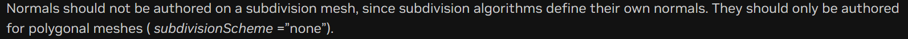

### Gf module
+ 基础的数据类型类，用于处理图形基本数学方面的类和函数
### Sdf module
+ path layer等抽象结构，序列化场景描述和交互的原始抽象提供了基础
+ 一般会用Sdf生成路径，管理路径结构
### Usd module
+ 面向客户端的核心模块，用于创作、合成和读取通用场景描述
+ 可以获取实体的路径和信息等
+ 可以输出debug信息等
### UsdGeom module
+ UsdGeom 模块定义了三维图形相关的基元和属性模式，为几何图形交换奠定了基础
+ class:
  + mesh、camera、shape等实体和属性类
  + Token:所有的属性
  + XformOp等法向量
### primvarsAPI (Class)
+ primvar 集成管理工具，生成，修改，获取实体的primvar，可以根据实体生成primvar管理器
### primvar (Class)
+ 个人理解类似一个命名空间，可以保证不同的渲染器可以通过标准命名空间对变量进行读取和使用,因为主要是协调渲染器的，因此变量多数与渲染和呈现有关
+ 根据primvar对象对其值进行修改
+ 详见：https://docs.omniverse.nvidia.com/kit/docs/pxr-usd-api/latest/pxr/UsdGeom.html#pxr.UsdGeom.Primvar
### Xform
+ Xform对象的实体基类，类似于scope
+ 定义或获取一个Xform实例
### Xformop
+ 数据类型的封装，类似于primvar，提供了定义数据实例，判断数据类型的方法
### Xformoptype
+ Xformop的属性种类，类似一个枚举类型
### Xformable
+ 所有可变换类的基类，是个属性积累，提供了添加各种变换的方法
### PointInstancer (Class)
+ Prototypes对象实例化容器
### Subset (Class)
+ 将对象的一系列子集编码为索引，(据文档说)目前只支持面基子集，未来会支持点和边的
+ https://docs.omniverse.nvidia.com/kit/docs/pxr-usd-api/latest/pxr/UsdGeom.html#pxr.UsdGeom.Subset
### 一些可能有用的条框
+ 多网格的mesh会自己生成normals，不能自己添加

+ pxr(库)->UsdGeom(module)->mesh(class)
+ 创建一个primvar属性(only way)：UsdGeomPrimvarsAPI::CreatePrimvar()，不能直接将现有属性提升为primvar
+ transform 属性不需要删除，直接添加新的形式，之前的就会disable
### 任务
+ 获取Mesh对象
+ 获取对象的属性
+ 更改属性，保存对象