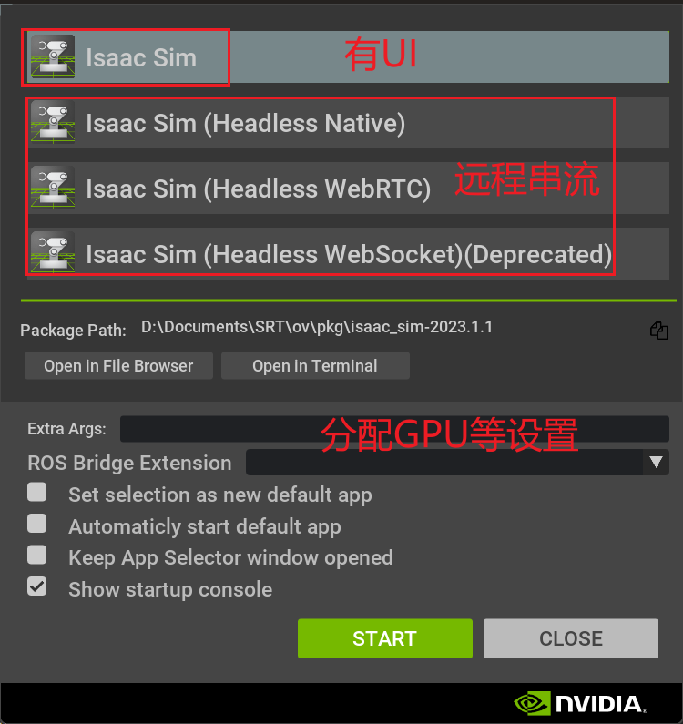
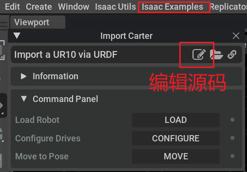
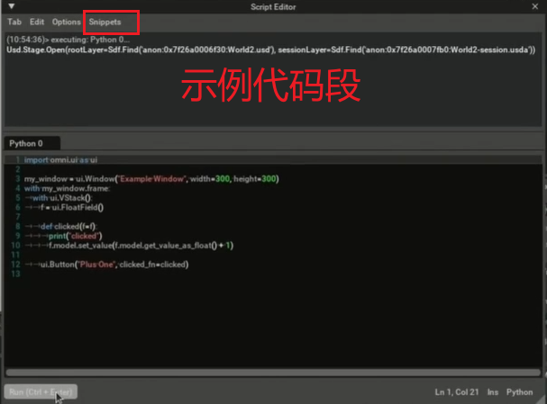
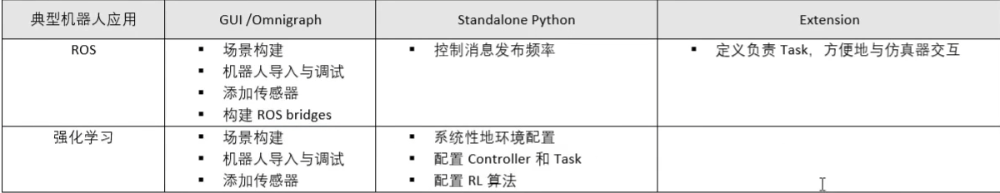
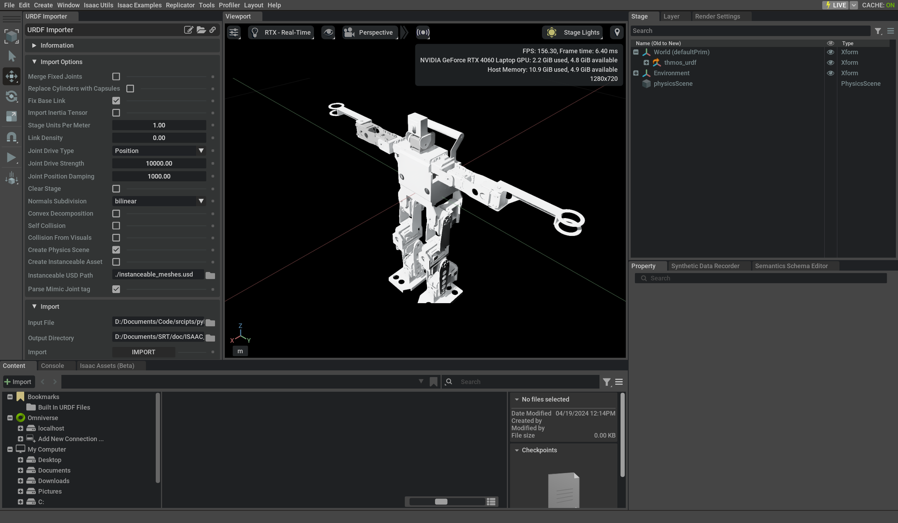
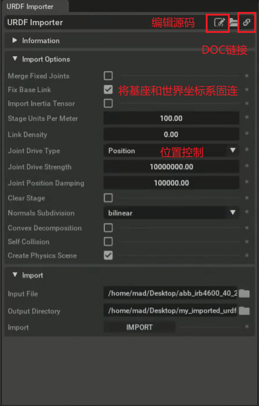

### 机器人控制和仿真平台
#### 库概述
+ omni.isaac.core
  + 基本机器人的定义和操作
+ omni.isaac.importer
  + 机器人描述文件支持 URDF、MCJF
+ isaac Replicator
  + 3D数据合成
+ Lula
  + 底层运动控制，逆运动学求解器，运动生成等
#### 开发流程
+ 开发工作流
  + GUI、Extension、独立Python脚本、jupyter
  + 支持和ROS互通，进行控制算法的验证
+ 仿真数据格式
  + RGB、深度点云、鱼眼
#### GUI

+ isaac utils
  + 机器人开发的文件导入等
+ isaac examples
  + 参考案例
+ synthetic data
  + 数据合成相关包
+ windows\extension
  + 拓展包
#### 基于Extension的开发
+ 通过Python设计extension，实现extension和仿真热交互
+ 方便导入已存在的extension，并修改源码  

#### 基于Srcipts Editer

#### 完全基于Python
+ 在安装目录上有独立python_example

### 开发案例
#### GUI创建机器人和控制
+ 教程链接：https://www.bilibili.com/video/BV1Ee4y1m71J/?spm_id_from=333.337.search-card.all.click&vd_source=55d021e2a2b2b82298ad677593d59ac3
+ 2022版本后，单位为m
+ 步骤概述
  + 创建实体
  + 添加物理碰撞属性
  + 添加关节
  + 添加关节驱动器
+ 机器人文件导入
  + URDF、MJCF(mujoco):Isaac Utils->workflows->MJCF importer/URDF importer
  + 检查文件是否正确：增益调节器和关节检查器
#### 自定义机器人URDF文件导入  

+ GUI导入和调试  

  
  + importer:导入URDF/MJCF
  + Articulation Inspector:机器人关节查看
  + Gain Tuner:关节PID参数调节(重力和增益置零)
+ 基于Hello World示例
  + Isaac example\Hello World
  + 引入omni.isaac.core.utils.stage import add_reference_to_stage
  + 在源码中添加usd文件路径和要导入Stage下的路径
  + add_reference_to_stage(usd_path=usd_path,prim_path=prim_path)
+ 导入传感器
  + create->Isaac->Sensors->...
  + 将相机放在哪个Xform下，它就会跟随哪个Xform移动
#### Core API
+ 
### 教程和资料
+ 官方教程
  + https://www.youtube.com/watch?v=nleDq-oJjGk
  + https://www.youtube.com/watch?v=1RSugmJ4_gs
  + https://www.youtube.com/watch?v=nXM5_mwUFOI
  + https://www.youtube.com/watch?v=VrTVUpDM7K8
  + https://www.youtube.com/watch?v=RhjRrUK2abs
  + https://www.youtube.com/watch?v=i4fGVc6lImo softbody simulation
  + https://www.youtube.com/watch?v=WhaybakLTXE
+ isaac_sim app
  + https://www.youtube.com/playlist?list=PL3jK4xNnlCVf1SzxjCm7ZxDBNl9QYyV8X
+ isaac_sim robots:好像是关于学习和机器人控制的，可以看看
  + https://www.youtube.com/playlist?list=PL3jK4xNnlCVdi9t6KQq6Z-cwhiVXlJv2p
+ b站公开课
  + https://www.bilibili.com/video/BV1Ee4y1m71J/?spm_id_from=333.337.search-card.all.click&vd_source=55d021e2a2b2b82298ad677593d59ac3
+ 知乎demo
  + https://zhuanlan.zhihu.com/p/546744364
+ 官网demo
  + https://docs.omniverse.nvidia.com/isaacsim/latest/how_to_guides/robots_simulation.html
+ hello robot
  + https://docs.omniverse.nvidia.com/isaacsim/latest/core_api_tutorials/tutorial_core_hello_robot.html
+ 机器人相关库
  + 关节控制：[omni.isaac.dynamic_control](https://docs.omniverse.nvidia.com/py/isaacsim/source/extensions/omni.isaac.dynamic_control/docs/index.html)
  + 运动生成和逆运动学：https://docs.omniverse.nvidia.com/isaacsim/latest/concepts/motion_generation/index.html#